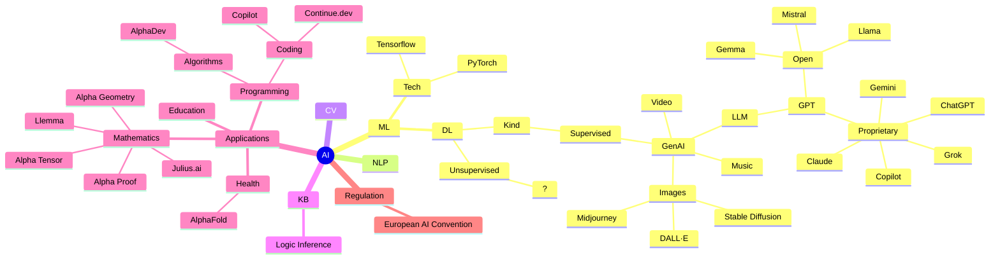

# 🔮 Artificial Intelligence  🏯 yesterday, 🕒 today and tomorrow 🚀

 

© 2024 by [Michael Vorburger.ch](https://www.vorburger.ch) (presenting in personal capacity and not representing employer)

Content licensed under [Creative Commons Attribution-ShareAlike 4.0 International](https://creativecommons.org/licenses/by-sa/4.0/?ref=chooser-v1).

_The source code of this presentation is [available on GitHub!](https://github.com/vorburger/LearningMachineLearning/tree/develop/docs/prez)_

<!--
I'll speak fast, let's chat together about questions during the breaks?
-->

---
layout: image
image: /images/google-gemini.png
backgroundSize: contain
---

# 🫢

<!--
How the heck does this work?! And what does all this mean for the future? BTW, you can try this out for yourself on gemini.google.com ...

Prompt: _Can you make this sound cooler?_

_Michael Vorburger has been fascinated by the creative power of computers from an early age. He is an avid hacker by night, see https://www.vorburger.ch, and currently works on ML technical infrastructure in management for Google by day. He is presenting at this event in his personal capacity, not representing his employer._

::right::

# Output 🫢

How does this work? What does this mean for the future?

_By night, Michael Vorburger transforms into a digital alchemist, coaxing unseen potential from the very ones and zeros that form our world. An avid hacker with a website that whispers secrets of the craft (https://www.vorburger.ch), he spends his days architecting the intricate machinery of Machine Learning infrastructure for Google. While tonight, he sheds his corporate cloak to share his personal visions, untethered and electrifying._
-->

---
layout: quote
---

_“AI is one of the most important things humanity is working on. It is more profound than (...) electricity or fire."_

Sundar Pichai, Google CEO, [2018](https://www.cnbc.com/2018/02/01/google-ceo-sundar-pichai-ai-is-more-important-than-fire-electricity.html).

 

_"It really was a huge surprise, when, in 2022, **AI woke up**."_

Bill Gates, in his _What's Next?_ (Netflix)

 

❓ What do _you_ think?

---
layout: image
image: /images/wordcloud.svg
backgroundSize: contain
---

<!--
https://www.jasondavies.com/wordcloud/
-->

---

# History 🏯

 

_Artificial Intelligence_ (AI) arguably [an 🏺 ancient dream](https://en.wikipedia.org/wiki/Timeline_of_artificial_intelligence).

_[Modern day AI](https://en.wikipedia.org/wiki/Outline_of_artificial_intelligence)_ from ~1960s, with emergence of Computer Science.

Initially 🔣 _"[symbolic](https://en.wikipedia.org/wiki/Symbolic_artificial_intelligence)"_ with _"rules",_ e.g. _Expert Systems_ à la [Cyc](https://en.wikipedia.org/wiki/Cyc).

AI ❄️ Winter/s.

 

_Machine Learning_ (ML), with _Deep Learning_ for _Generative AI_ are subfields of AI...

...which are different - why?

<!--
AI arguably started in antiquity - the 1st link is to an interesting "AI history" sort of table on Wikipedia, which mentions e.g. ancient Greek myth of Talos, the giant automaton in Crete from ca. 700 BC, or the jewish Golem, or the Takwin of Muslim alchemists from 8th century, or the Homunculus of 16th century European alchemists such as Paracelsus, or perhaps even the Tulpa of Tibetan Buddhism's, and later Theosophists.

...

To give you a current day timeline, a scientific paper that is often referred to as a breakthrough milestone is the Transformer's by Researchers at Google, published (only) in 2017.

But let's take a quick detour...

* https://arxiv.org/abs/1706.03762
* https://proceedings.neurips.cc/paper_files/paper/2017/file/3f5ee243547dee91fbd053c1c4a845aa-Paper.pdf
* https://research.google/blog/transformer-a-novel-neural-network-architecture-for-language-understanding/
* https://www.wired.com/story/eight-google-employees-invented-modern-ai-transformers-paper/
-->

---
layout: fact
---

# What is _programming ❓_

---

# What is _programming?_

 

Programming gives computers precise instructions, like:

- Print `hello, world`
- Variable `i = 7`
- `if` i is still 7 `then` _do-that_
- `for` loop 7 times

Written in a computer language - try out [Scratch](https://scratch.mit.edu), it's great to learn concepts!

<small>(Or C++ or Java & Kotlin or C# or Python or JavaScript & TypeScript or Go or Rust, etc.)</small>

<!--
Programming, AKA coding, gives computers precise instructions, very precise, which we call,for what you want them to do.
-->

---
layout: fact
---

# How did you learn your mother tongue?

---
layout: two-cols-header
---

# How _did_ you learn your mother tongue?

::left::

## a)

I 👶 was 💻 _programmed_ by being 🍼 fed many 🔪 chopped up grammar and vocabulary 📖 books, and thus learned syntax and semantics to sound smart!

::right::

## b)

I 🐤 babbled incoherently for **years**, until, after _a lot of_ visual 😙 and 👂 audio cue _reinforcements,_ I **finally** figured out how to make sense!

<!--
Quick show of hands... who a) ... who b) ❓ 😆
-->

---

# Machine Learning (ML)

Treat computers like 👶 babies! Probabilistics:

- _♟️ Chess_ through _trial & error_ - instead _rules_
- _👀 Vision_ with example images - instead _algorithms_
- _📸 Camera 📱 quality_ similarly - instead _filters_
- _✍️ Grammar Checking_ from examples - instead _language grammar_
- _🌐 Machine translation_ by "reading" human translated books - instead _2 grammars_
- _💬 Large Language Models_ (LLM) by _"reading"_ **lots** of text

 

Idea is not new ([backpropagation](https://en.wikipedia.org/wiki/Backpropagation) ~1980s?)...

...but only quite recently (~2010s+ ?) turned out to become more 🚀 viable at scale, due to the

availability of _Big Data_ and massive storage & _Super Computer_ infrastructures in _☁️ Clouds._

<!--
The idea of ML is ~ just to treat computers as 👶 babies, instead of _programming_ them! For example:

...

LLMs basically do the same to be able to reply to prompts where you chat with them and ask them questions.

The basic idea is not that new ([backpropagation](https://en.wikipedia.org/wiki/Backpropagation) ~1980s?)...

...but only recently (~2010s+ ?) it suddenly turned out to be a lot more 🚀 interesting, due to the

emerging increasing availability of _Big Data_ and massive storage & _Super Computer_ infrastructures in _☁️ Clouds._
-->

---
layout: center
---

# Magic?

Is ML 🪄 magic? Not at all... basic idea is quite simply, actually! To illustrate:

🏫 Remember? `y = a*x + b` 🧮

 

Given a _training data set_ of e.g. car fuel efficiency `(x,y)` _points,_

where `X` is a 🚗 car's 🏋️ weight, and `Y` is its KMs per Liter of Gas (or 🔋)...

...find "best" `a` and `b` - that's a _"model",_ of 2 parameters!

 

Given new car's _weight_ (X), you can _predict_ its consumption (Y).

<!--
Is ML 🪄 magic? Not at all... the basic idea is really quite simply, actually! To illustrate:
-->

---
layout: image
image: /images/car-data-points-with-model.png
backgroundSize: contain
---

<!--
Picture says more than words? But how did we find the a & b parameter...
-->

---
layout: image
image: /videos/linear_regression.gif
backgroundSize: contain
---

<!--
We literally just make a computer program try out values for a and b, to try to make the model have "good accuracy" - in this case, that just means "making the red line as close to those green points as it can be".

E.g. a large language model really is (kind of) similar to this - except that instead of have 2 parameters, for a and b, it has more - many more...

Copyright © 2020-2021 Gajanan Bhat. All rights reserved.

<https://gbhat.com>
-->

---
layout: image
image: /videos/Multi-Linear Regression Model Visualization.gif
backgroundSize: contain
---

<!--
... imagine, that instead of only having to find x2 parameters, a & b, for X car weight and Y gas (or 🔋 electricity!) consumption, you need more parameters, e.g. for Pie Sales, Price, and Advertising cost?

PS: This is technically mathematically not entirely accurate (because it's not really about spatial dimensions, but function parameters; really a quadratic or N polynomial function on 2-D X & Y would in a sense be more accurately making this point) - but this is a just a better visual illustration! ;-)

<https://github.com/rafiag/DTI2020/blob/main/images/Multi-Linear%20Regression%20Model%20Visualization.gif>
-->

---

# 🧠 Your Brain is a Biological Neural Network

<!--
If in addition to remembering Linear Regression from your High School Math class you also remember a little bit of your biology 101, then perhaps this image is familiar to you? It's
-->

---
layout: image
image: /videos/playground.tensorflow.org.webp
backgroundSize: contain
---

&nbsp; &nbsp; &nbsp; &nbsp; &nbsp; [Tensorflow Playground](https://playground.tensorflow.org)

---

# GenAI ML Models

GenAI ML Models really are just such parameters...

... except that a real LLM is _a little bit_ bigger!

E.g. [Google's open source Gemma](https://ai.google.dev/gemma) (v2) has **27 billion** 👍 parameters!

(And [Google's Gemini Models](https://deepmind.google/technologies/gemini/) are even bigger.)

 

💬 Words to 1️⃣2️⃣3️⃣ numbers & 🧮 _prediction!_

Or 🗣️ voice. Or 🖼️ images. Or 🎥 videos.

 

Often _Pipelines_ of \* N models.

<!--
Instead of just 2 or 3 such parameters, as seen previously.

In reality often not just 1 model, but Pipelines with Workflows connecting several models; e.g. LangChain's LangGraph in FLOSS.
-->

---
layout: two-cols-header
---

# Training & Inferring

Separate phases

::left::

_Supervised Learning / Training_ **creates** _ML Models_

of _Parameters_ - from _labeled_ input training data.

Effort (~) proportional to size of input data.

 

_Finding `a` & `b` etc. (**27B!**) parameters._

::right::

_Inferring_ (AKA _serving)_ is giving a model new

(unseen) input, asking it to _"infer"_ output.

Effort is (comparatively) much smaller.

 

_Calculating `Y` given `X`, having `a` & `b`._

<!--
Pictures of digits, cats & dogs, or texts...

📱 Mobile Phones can ✨ do (~) inference locally.

No ☁️ Cloud (DC) is more 🔏 #private & #fast.
-->

---
layout: center
---

# Data?

 

You need a **massive** amount of text & images & video to train Large Models with billions of parameters...

©️ ® ™ 👩‍⚖️ ❓

---
layout: center
---

# Energy?

Specialized Hardware (GPU, TPU, NPU) - for parallel 🤓 matrix computation (similar to 🎮 gaming graphics).

Both training (more), but also inference (less); use 🔋 energy... 🐢 🐧 ? Efficiency research.

 

Who pays? You, eventually, e.g. with:

- 🎥 Ads

- 🪟 Licenses

- 🤑 Pricey 🍎 HW 📱

- 💸 Subscriptions

<!--
https://www.tomshardware.com/tech-industry/artificial-intelligence/using-gpt-4-to-generate-100-words-consumes-up-to-3-bottles-of-water-ai-data-centers-also-raise-power-and-water-bills-for-nearby-residents
-->

---
layout: image
image: /images/TPU_v5L_Pod_-_Front_View_-_Web.max-2600x2600.jpg
backgroundSize: contain
---

---
layout: center
---

# Cloud? Open Source?

ChatGPT & Google Gemini etc. run in the ☁️ Cloud.

You can download e.g. Google's ♊ Gemma, Meta's
 🦙 Llama, 🇫🇷 Mistral, et al., to run them yourself.

Do try e.g. [Ollama](https://ollama.com) to run an [LLM @ Home 🏡](https://github.com/vorburger/vorburger.ch-Notes/blob/develop/ml/ollama1.md)
 (e.g. AMD RX 7600 = $400 or NVIDIA H100 = $30k!).

 

LM training is still proprietary - it's hard to DIY.

(But you can train smaller models, or _fine tune.)_

---
layout: image
image: /images/h100.webp
backgroundSize: contain
---

---
layout: image
image: /images/notebooklm.google.com.png
backgroundSize: contain
---

---

# Personalized LLM

Large Models might know about "the world", not (yet) "your world"... but:

- Huge prompts _("context window size")_ to "chat with your PDFs" works; try e.g. [NotebookLM](https://notebooklm.google)!

- _Fine Tuning_ is another ML technique to efficiently adapt a previously pre-trained model with new data.

- Coming to 🤑 device gadgets near you: 🪟 Copilot+ 💻 PCs, 📱 Google Pixel 8, 🍎 Apple Intelligence, etc.

- Try e.g. Google Gemini Workspace Extensions...

---
layout: two-cols
---

# E.g. Gemini Extensions

 

::right::

---
layout: image
image: /images/star-trek-scotty.gif
---

<!--
Scotty tries to talk into the mouse of a computer in Star Trek... this used to be a joke, but... we're there now.
-->

---

# Gaps?

It's still early days. But more is coming - and (very) quickly...

- Cure LM 🤡 Hallucinations?
  - 😲 Surprise: Users learn prompting, hallucinations no barrier
  - Grounding in Facts, e.g. LLM + KB/KG with RAG; or [_"neuro-symbolic"_](https://en.wikipedia.org/wiki/Neuro-symbolic_AI)
  - _Explainable Neural Networks (XNNs)_
- More Multi Modal, and Sensing ([watch Project Astra](https://deepmind.google/technologies/gemini/project-astra/)!) #latency
- Interacting with Our World (Web, APIs)
- New UX? **Knowledge agent design?**
  - Assistants on Mobile Devices
  - Web Search _("Googling")_ merges with LLMs; e.g. [Google SGE](https://blog.google/products/search/generative-ai-search/) or browsers (e.g. Brave); future is hybrid.

<!--
Combining Large Language Models (LLMs) with Knowledge Graphs (KGs) and Retrieval-Augmented Generation (RAG) looks promising.

You would be surprised how difficult it is to build an Assistant that can buy movie tickets or make restaurant reservations only.

Something like Gemini's Extensions, to connect it to your Gmail & Google Docs, Google Maps or Flights, or YouTube are only the very early beginning.

Google Search Generative Experience (SGE)
-->

---
layout: image
image: /images/KITT_Speaks_Spanish_Knight_Rider-ezgif.com-video-to-gif-converter.gif
---

<!--
I'm not a cars sort of guy, but if I were, I would be pretty excited to get my Knight Rider KITT, any day now...
-->

---
layout: center
---

# The Future?

Artificial general intelligence - AGI? Superintelligence?

 

Not super clear what exactly _"AGI"_ really means...

Generally used as ~ _"[it can do some of your work](https://en.wikipedia.org/wiki/Artificial_general_intelligence#Tests_for_human-level_AGI)"._

_Matrix_ of 🤖 _Terminator_ taking ☠️ over?

More like 🧠 humans' latest 🛠️ tool...

Jobs will change, yes - but haven't they always? 🐎

 

The next few years are going to be very interesting!

<!--
I didn't come here with a horse carriage, like I would have just a 100 year ago; and we don't have coachmen anymore, we didn't need that job anymore.

But in the bright side, there A LOT of new jobs nowadays which didn't exist 100 years ago.

Turing Test, Robot College Student Test, Employment Test, Ikea Test, Coffee Test, Modern Turing Test
-->

---

# Applications

 

💬 Chat Bots, [Image](https://huggingface.co/spaces/nyxai-lab/perspectives-on-ai) & [Movie Generation](https://www.youtube.com/@aicinemaof)

💻 Coding: E.g. GitHub Copilot (and others)

🏢 Productivity: E.g. documents, email summary; or Meeting Minutes transcription

⚕️ **Health:** E.g. [Google's Health AI](https://ai.google/discover/healthai/) for breast cancer 🩻 [screening](https://www.youtube.com/watch?v=CzgMUVPduZA) or expanding access to ultrasound

⚛️ **Science:** E.g. Google DeepMind's 🧬 [AlphaFold](https://www.youtube.com/watch?v=gg7WjuFs8F4) (open [access](https://alphafoldserver.com/)), or 🧮 [Math](https://deepmind.google/discover/blog/ai-solves-imo-problems-at-silver-medal-level/) 🏅 Olympiad

🎒 **Education:** E.g. [Khan Academy's Khanmigo](https://www.youtube.com/watch?v=hJP5GqnTrNo&t=4s), or Homework with [Google Lens](https://lens.google)

🧟 Deepfakes & 🙊 misinformation spam - **and** their 🕵️‍♀️ detection

 

Is (some of) this _"creative"?_ Does 🧞 it _"think"?_ What **really** is creativity and thinking... 🤔

<!--
AlphaProof & AlphaGeometry solved 4 / 6 problems from this year’s International Mathematical Olympiad (IMO);
https://www.theguardian.com/technology/article/2024/jul/25/google-deepmind-takes-step-closer-to-cracking-top-level-maths

Khan also e.g. https://www.youtube.com/watch?v=_EfEoSP7oYQ (after aforementioned TED Talk)

TODO Try Google Lens with Homework & screenshot it

https://c2pa.org for GenAI?
-->

---
layout: image
image: /images/alphafold.png
backgroundSize: contain
---

<!--
Google DeepMind's AlphaFold "protein folding" breakthrough unlocking research of new medicines
-->

---
layout: image
image: /videos/Optimism-Captain.webp
backgroundSize: contain
---

<!--
To quote Dr. Phlox, from Star Trek: "Optimism, Captain!"

# Optimism

<SlidevVideo v-click autoplay controls>
  < ! -- Anything that can go in an HTML video element. - - >
  <source src="/videos/Optimism-Captain.mp4" type="video/mp4" />
  

    Your browser does not support videos. You may download it <a href="/videos/Optimism-Captain.mp4">here</a>.
  

</SlidevVideo>
-->

---

# You?

Machine Learning is a lot of fun! Get started with exploring it today:

1. [`gemini.google.com`](https://gemini.google.com) to learn _"Prompt Engineering"_
1. [Google AI Explorables](https://pair.withgoogle.com/explorables/)
1. [Tensorflow Playground](https://playground.tensorflow.org)

For developers:

1. [ML Zero to Hero x4 ~6' (=24') Videos](https://www.youtube.com/playlist?list=PLQY2H8rRoyvwWuPiWnuTDBHe7I0fMSsfO)
1. [Google Machine Learning Crash Course](https://developers.google.com/machine-learning/crash-course)
1. [TensorFlow Quickstart](https://www.tensorflow.org/tutorials/quickstart/beginner)
1. [TensorFlow Learn ML](https://www.tensorflow.org/resources/learn-ml)
1. [Google AI Build](https://ai.google/build)

More on (my) [LearningMachineLearning](https://github.com/vorburger/LearningMachineLearning/blob/develop/docs/resources.md) - contributions welcome.

---
layout: center
---

<!--
https://en.wikipedia.org/wiki/Artificial_intelligence

TODO Expand this, modeling it with (my) https://docs.enola.dev, similar to (TBD) https://github.com/enola-dev/enola/blob/main/models/enola.dev/other.ttl
-->
